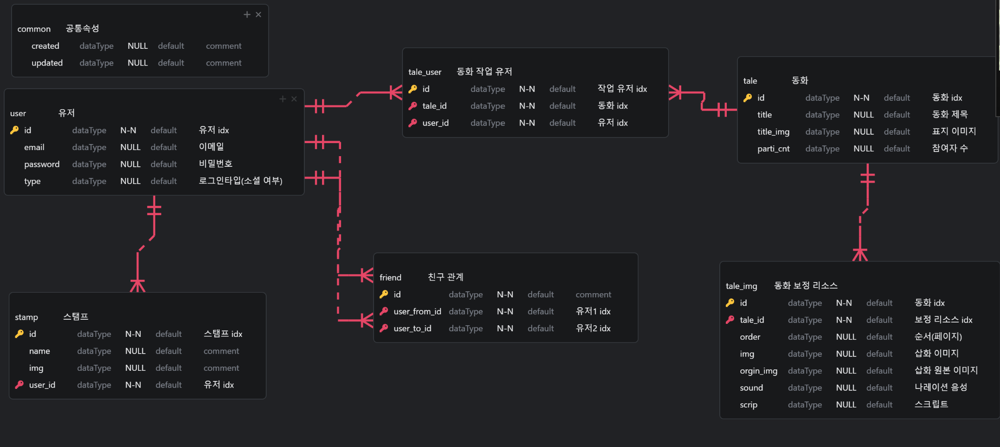
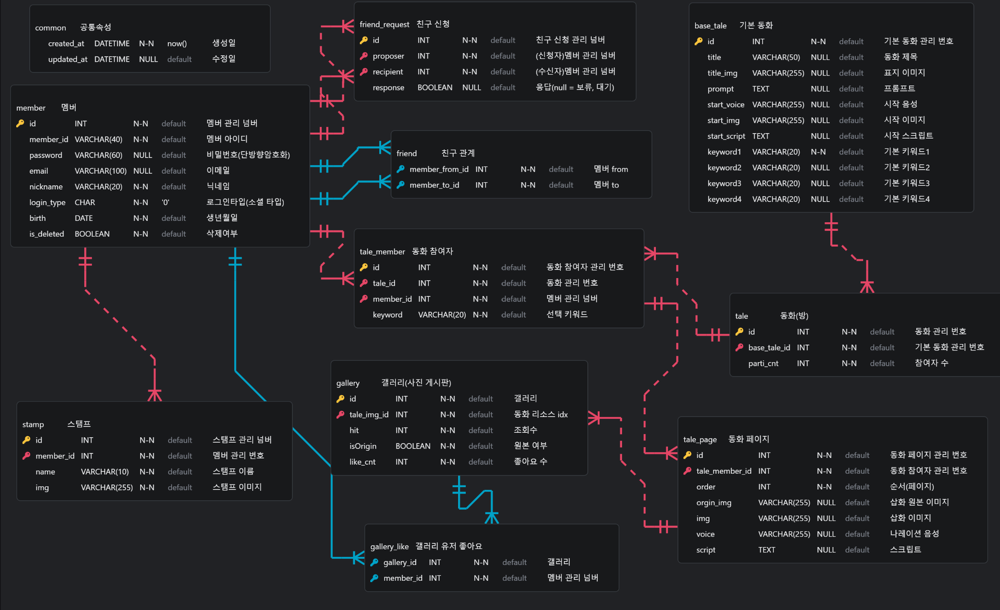

# 0113
### 3D 가면을 구현하기 위해 필요한 기술


https://github.com/google-ai-edge/mediapipe/blob/master/docs/solutions/face_mesh.md

### 얼굴 추적
- OpenCV: 얼굴 감지 및 위치 추적
- MediaPipe: 얼굴의 468개 랜드마크를 추적하여 정확한 얼굴 위치, 각도, 크기를 감지
- ARKit/ARCore: 얼굴의 위치와 회전을 감지하는 AR 플랫폼

### 3D 이미지화 및 가면 렌더링
- ThreeJS : 3D 렌더링 제공
(Meta 등의 제공은 대부분 Unity 플랫폼 기준으로 제공되는 라이브러리)

### 결론
1. 이미지화 및 가면 렌더링링 - 평면 이미지 가면을 3D화 시켜 주어야 한다. -> ThreeJS
2. 얼굴 추적 - 가면을 얼굴의 위치에 맞게 배치해주어야 한다. -> mediapipe facemesh

## Redis 개념 정리
### Redis란?
- Remote Dictionary Server의 약자임
- 인메모리 데이터 구조 저장소로, 주로 캐싱, 세션 관리, 실시간 데이터 처리에 사용됨
- 데이터를 메모리에 저장해서 빠른 읽기/쓰기 성능 제공
- key-value 기반의 NoSQL 데이터베이스
- 다양한 데이터 구조 지원: String, Hash, List, Set, Sorted Set, Stream 등
### Redis 주요 특징
- 초고속 성능
    - 메모리에 데이터를 저장하기 때문에 밀리초 단위의 읽기/쓰기 속도를 보장함
- 다양한 데이터 타입 지원
    - 단순 키-값 외에도 복잡한 데이터 구조를 지원함
- Persistence(지속성)
    - 데이터를 디스크에 저장하여 재시작 시 데이터 복구 가능
        - RDB: 특정 시점의 데이터를 스냅샷으로 저장
        - AOF: 모든 쓰기 연산을 기록해서 복구
- Pub/Sub 지원
    - 메시징 시스템처럼 사용할 수 있음 (채팅, 알림 시스템 구현 가능)
- 분산 처리
    - 클러스터링으로 확장성과 가용성을 보장함

## Redis 시작하기
### 1. 의존성 추가
`implementation 'org.springframework.boot:spring-boot-starter-data-redis'`
### 2. Redis 호스트 설정
```
spring:
  redis:
    host: localhost
    port: 6379
```
### 3. Redis 설정
```
@Configuration
public class RedisConfig {

    @Value("${spring.redis.host}")
    private String host;

    @Value("${spring.redis.port}")
    private int port;

    @Bean
    public RedisConnectionFactory redisConnectionFactory() {
        return new LettuceConnectionFactory(host, port);
    }
}
```
### 4-1 레파지토리 형식
- Domain Entity를 Redis Hash로 만들 수 있다다.

#### Entity
```
@Getter
@RedisHash(value = "people", timeToLive = 30)
public class Person {

    @Id
    private String id;
    private String name;
    private Integer age;
    private LocalDateTime createdAt;

    public Person(String name, Integer age) {
        this.name = name;
        this.age = age;
        this.createdAt = LocalDateTime.now();
    }
}
```

#### Repositoty
```
public interface PersonRedisRepository extends CrudRepository<Person, String> {
}
```

#### Example
```
@SpringBootTest
public class RedisRepositoryTest {

    @Autowired
    private PersonRedisRepository repo;

    @Test
    void test() {
        Person person = new Person("Park", 20);

        // 저장
        repo.save(person);

        // `keyspace:id` 값을 가져옴
        repo.findById(person.getId());

        // Person Entity 의 @RedisHash 에 정의되어 있는 keyspace (people) 에 속한 키의 갯수를 구함
        repo.count();

        // 삭제
        repo.delete(person);
    }
}
```
 - JPA와 동일하게 사용
 - id 값을 따로 설정하지 않으면 랜덤한 키값
 - 저장할때 `save()`, 조회할 때 findById()

# 0114

#### 기본 기능
- 실시간 비디오 및 오디오 스트리밍
- 화면 공유
- 녹화 기능
- Custom Layouts
#### 인터랙티브 기능
- 채팅 및 데이터 메시지
- WebRTC 데이터 채널
- Publisher 및 Subscriber 역할 분리
### 확장 및 통합
- REST API
- WebSocket API
- OpenVidu Browser SDK
- OpenVidu Server 및 Docker 배포

### OpenVidu에서 각 기능 별 역할(백, 프론트)
#### 백엔드(Spring)의 역할
> 백엔드는 OpenVidu 서버와 클라이언트(프론트엔드) 간의 중재자 역할을 수행하며, 보안, 세션 관리, 권한 제어 등의 핵심 기능을 담당함.

- OpenVidu 서버와 통신
    - 세션 생성, 토큰 발급, 세션 종료 등의 관리
- 세션 및 토큰 관리
    - OpenVidu 세션의 생성, 토큰 발급 및 유효성 검증 담당
    - 클라이언트가 세션에 참여할 수 있도록 토큰 제공
#### 프론트엔드(React)의 역할
> 프론트엔드는 OpenVidu 세션에서 사용자 인터페이스를 제공하며, 사용자가 미디어를 전송하거나 수신하고, 화면을 제어할 수 있도록 함.

- OpenVidu 클라이언트 연동
    - OpenVidu JavaScript SDK를 사용해 WebRTC 미디어 스트림을 관리
    - 세션에 참여하거나 스트림 전송
- UI 렌더링 및 사용자 인터페이스 제공
    - 사용자 카메라, 마이크, 화면 공유, 채팅 등을 제어할 수 있는 UI 제공
    - 토큰 전달 및 세션 참여
- 백엔드에서 발급받은 토큰을 통해 OpenVidu 세션에 참여
- 이벤트 관리
    - 세션 내 미디어 스트림 추가/제거, 사용자 참여/퇴장 등의 이벤트 처리
- 사용자 입력 처리
    - 카메라 켜기/끄기, 음소거, 화면 공유 시작/중지 등 사용자 동작 처리


# 0115
## ERD 초안 작성


# 0116
## ERD 검토 수정 작업

## Spring Boot에서 STOMP 시작하기
### STOMP란?
- Simple (or Streaming) Text Oriented Messaging Protocol의 약자임
- 메시지 브로커를 사용하는 Pub/Sub(발행/구독) 모델을 지원하는 텍스트 기반 메시징 프로토콜
- 주로 WebSocket 위에서 동작하며, 클라이언트와 서버 간의 실시간 양방향 통신을 구현하기 위해 사용됨
### 의존성 추가
- Spring Boot 프로젝트의 build.gradle 또는 pom.xml에 WebSocket 의존성 추가해야 함

`implementation 'org.springframework.boot:spring-boot-starter-websocket'`

### WebSocket 설정
- WebSocket과 STOMP를 연결하려면 설정 파일 작성 필요
```
import org.springframework.context.annotation.Configuration;
import org.springframework.messaging.simp.config.MessageBrokerRegistry;
import org.springframework.web.socket.config.annotation.EnableWebSocketMessageBroker;
import org.springframework.web.socket.config.annotation.StompEndpointRegistry;
import org.springframework.web.socket.config.annotation.WebSocketMessageBrokerConfigurer;

@Configuration
@EnableWebSocketMessageBroker
public class WebSocketConfig implements WebSocketMessageBrokerConfigurer {

    @Override
    public void configureMessageBroker(MessageBrokerRegistry config) {
        config.enableSimpleBroker("/topic");
        config.setApplicationDestinationPrefixes("/app");
    }

    @Override
    public void registerStompEndpoints(StompEndpointRegistry registry) {
        registry.addEndpoint("/ws")
                .setAllowedOriginPatterns("*") // CORS 허용
                .withSockJS(); // SockJS 지원
    }
}
```
### Controller 작성
- 메시지를 처리할 컨트롤러 작성

```
import org.springframework.messaging.handler.annotation.MessageMapping;
import org.springframework.messaging.handler.annotation.SendTo;
import org.springframework.stereotype.Controller;

@Controller
public class ChatController {

    @MessageMapping("/sendMessage")
    @SendTo("/topic/messages")
    public String sendMessage(String message) {
        return "전송된 메시지: " + message;
    }
}
```
### 클라이언트 연동

- JavaScript로 WebSocket 연결 구현
```
<script src="https://cdn.jsdelivr.net/npm/sockjs-client"></script>
<script src="https://cdn.jsdelivr.net/npm/stompjs"></script>
<script>
    const socket = new SockJS('/ws');
    const stompClient = Stomp.over(socket);

    stompClient.connect({}, () => {
        stompClient.subscribe('/topic/messages', (message) => {
            console.log('받은 메시지:', JSON.parse(message.body));
        });

        stompClient.send('/app/sendMessage', {}, JSON.stringify({ message: 'Hello World!' }));
    });
</script>
```
 - WebSocket 연결 후 /topic/messages를 구독한 클라이언트에게 메시지가 전달되는지 확인하면 됨

 ## Redis와 Stomp의 sub/pub 비교
> Redis에서도 sub/pub 기능을 제공한다...

### STOMP를 사용하는 경우
- 실시간 채팅, 알림 시스템처럼 클라이언트 간 양방향 실시간 통신이 필요한 애플리케이션
- 메시지 신뢰성(Delivery Guarantee) 요구가 높고, 외부 메시지 브로커 사용이 가능한 경우
### Redis Pub/Sub을 사용하는 경우
- 빠르고 간단한 메시지 전달이 필요한 경우 (예: 서버 간 알림 전송, 분산 환경에서의 상태 동기화)
- Redis를 이미 사용하고 있는 시스템에서 추가 설정 없이 메시징 기능을 활용하고 싶은 경우

### 결과
- redis에서 pub/sub은 브로드캐스트 성격을 띈다.
- 클라이언트간의 실시간 통신에 중점을 두는 부분이므로 STOMP가 적합!!
