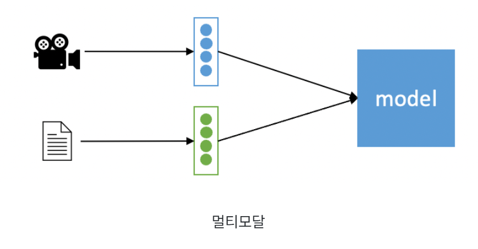
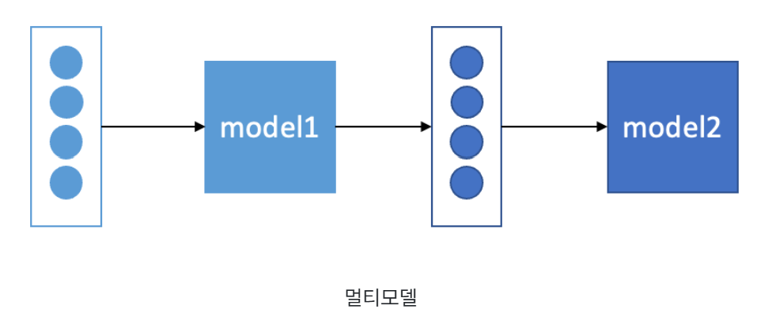

<details>
  <summary>2025-01-13</summary>

# 멀티모달

- 여러 개의 데이터 형식을 가지고 수행하는 AI
  - 주로 텍스트, 이미지, 음성, 비디오 등
- text 데이터와 함께 쓰는 경우가 가장 활발하게 상용화 되는

  ### 📌 멀티모달 VS 멀티모델 ?

  

  - input data 종류가 2가지 이상인 경우, 모델은 1개 이상

  

  - input data의 종류가 1가지면서 여러 개의 모델을 거치는 방식

  ## ChatGPT 멀티모달

  https://cookbook.openai.com/examples/multimodal/vision_fine_tuning_on_gpt4o_for_visual_question_answering

  ### 이미지 - 텍스트

  1. **CLIP (Contrastive Language-Image Pre-Training)**

  - 대규모 웹 언어-이미지 병렬 데이터셋에서 언어와 이미지 간의 상호 작용을 학습하는 방식으로 구성
  - 텍스트 입력 만으로도 주어진 정보에 해당하는 이미지 정보를 얻어내어 활용 가능
  - 반대로 이미지 입력에서 원하는 텍스트 정보를 추출 가능

  2. **Zero-Shot Learning**

  - 학습 중에 학습한 언어적 표현과 이미지 특징을 활용하여, 학습 과정에서 보지 않은 클래스에 대한 이미지 분류를 수행
  - 모델이 이미지에 대한 언어적 표현과 이미지 자체의 특징을 고려하여 새로운 클래스에 대한 예측을 수행

  3. **VQA (Vision Question Answering)**

  - 입력 모달리티인 이미지와 관련된 질문에 대한 답을 자연어로 출력해 주는 작업
  - 비전 데이터에 존재하는 객체나 배경에 대한 질문을 할 수도 있고, 인물의 상황과 행동에 관한 질문에 답을 얻을 수도 있음

</details>

<details>
  <summary>2025-01-14</summary>

# Zustand VS redux

| **항목**                  | **Redux Toolkit**                                                                                                | **Zustand**                                                                                                                                                  |
| ------------------------- | ---------------------------------------------------------------------------------------------------------------- | ------------------------------------------------------------------------------------------------------------------------------------------------------------ |
| **철학**                  | Flux 패턴 기반, 전역 상태 관리를 위한 강력한 도구 제공                                                           | 단순하고 가벼운 상태 관리, Flux 패턴 필요 없음                                                                                                               |
| **설치 및 크기**          | 상대적으로 무거움 (`redux`, `@reduxjs/toolkit`, `react-redux` 필요)                                              | 매우 가벼움 (단일 라이브러리, 추가 의존성 없음)                                                                                                              |
| **사용법**                | - 상태, 리듀서, 액션을 정의해야 함                                                                               | - 보일러플레이트를 줄이는 다양한 툴 제공 (e.g., `createSlice`, `createAsyncThunk`) - 상태와 업데이트 로직을 한 곳에서 정의 - 심플한 API (`create` 함수 사용) |
| **비동기 로직 처리**      | - 내장된 `createAsyncThunk`로 비동기 작업 처리 - 미들웨어를 활용해 복잡한 비동기 로직 구현 가능                  | - 별도의 도구 없이 상태 업데이트 로직 내에서 비동기 호출 가능 - 단순 Promise 기반 코드에 적합                                                                |
| **미들웨어**              | - Redux의 미들웨어 활용 가능 (e.g., Redux Thunk, Redux Saga)                                                     | - 내장 미들웨어 없음 - 기본적으로 미들웨어 없이 사용되지만 `zustand/middleware` 패키지로 확장 가능                                                           |
| **개발자 도구 지원**      | - Redux DevTools 내장 지원                                                                                       | - Redux DevTools를 기본적으로 지원하지만, 사용하려면 설정 필요 (`devtools` 미들웨어 사용)                                                                    |
| **TypeScript 지원**       | - 강력한 TypeScript 지원 - `createSlice`를 사용해 타입을 더 쉽게 관리 가능                                       | - 기본적으로 TypeScript 지원 - 상태와 액션의 타입을 직접 선언해야 함                                                                                         |
| **리렌더링 최적화**       | - `useSelector`를 통해 특정 상태만 구독 가능 - 상태 변경 시 구독된 컴포넌트만 리렌더링                           | - 상태의 일부만 구독 가능 - 상태 변경 시 구독된 부분만 리렌더링                                                                                              |
| **언제 사용하면 좋은가?** | - 복잡한 대규모 애플리케이션 - 상태가 다수의 컴포넌트와 모듈에서 공유되어야 할 때 - 고급 비동기 작업이 필요할 때 | - 간단한 상태 관리가 필요한 경우 - 소규모 애플리케이션 또는 특정 모듈별 상태 관리 - 빠른 개발 속도가 중요한 경우                                             |

---

### 📌 Flux 패턴?

**페이스북**에서 만든 애플리케이션의 데이터 흐름을 관리하기 위한 아키텍처 패턴

**❤️단방향 데이터 흐름 (Unidirectional Data Flow)**

Flux의 핵심은 데이터가 한 방향으로만 흐르는 구조를 가진다

- **데이터 흐름**:`View (사용자 인터페이스)` → `Action` → `Dispatcher` → `Store` → 다시 `View`.

**❤️Flux의 주요 구성 요소**

- **Action**
  상태(state)를 변경하기 위해 발생하는 이벤트나 명령.
  - 예: "사용자가 버튼을 클릭하여 새로운 아이템을 추가하려고 한다"는 액션.
  ```jsx
  const action = {
    type: "ADD_ITEM",
    payload: { id: 1, name: "Apple" },
  };
  ```
- **Dispatcher**
  모든 액션이 통과하는 중앙 허브 역할.
  - 액션을 `Store`로 전달하며, 이를 통해 상태 변경이 이루어짐.
  - React의 Redux에서는 이미 내장된 형태로 제공되므로 직접 다룰 필요가 거의 없음.
- **Store**
  애플리케이션의 상태를 저장하는 장소.
  - 상태를 변경하려면 반드시 `Action`을 통해야 함.
  - 여러 Store가 있을 수도 있지만, Redux에서는 단일 Store를 사용하는 것이 일반적.
- **View**
  React 컴포넌트로, Store로부터 상태를 받아 사용자에게 보여줌.
  - 상태 변경이 일어나면 View가 리렌더링됨.

### 📌 보일러플레이트?

프로그래밍에서 **반복적이고 기본적으로 많이 작성해야 하는 코드**

- Redux는 기본적으로 Flux 패턴을 사용하기 때문에, 액션, 리듀서, 스토어를 각각 정의
- → Redux Toolkit은 반복적인 코드를 자동으로 처리해주는 유틸리티를 제공
</aside>

## Redux-toolkit

```jsx
// src/store.js
import { configureStore, createSlice } from "@reduxjs/toolkit";
const initialState = {
  inputValue: "",
};

const inputSlice = createSlice({
  name: "input",
  initialState,
  reducers: {
    setInputValue(state, action) {
      state.inputValue = action.payload;
    },
  },
});
export const { setInputValue } = inputSlice.actions;
export default configureStore({
  reducer: {
    input: inputSlice.reducer,
  },
});
```

```jsx
// src/App.js
import React from "react";
import { useDispatch, useSelector } from "react-redux";
import { setInputValue } from "./store";
function App() {
  const dispatch = useDispatch();
  const inputValue = useSelector((state) => state.input.inputValue);
  const handleInputChange = (e) => {
    dispatch(setInputValue(e.target.value));
  };
  return (
    <Provider store={store}>
      {" "}
      {/* Provider로 애플리케이션을 감싸서 Redux Store를 제공 */}
      <input type="text" value={inputValue} onChange={handleInputChange} />
      <p>Input Value: {inputValue}</p>
    </Provider>
  );
}
export default App;
```

- `createSlice` 함수를 사용해 리듀서를 정의하고, `configureStore` 함수를 통해 store를 생성
- store를 Provider를 통해 연결하고 input의 값을 Redux store로 관리

## Zustand

```jsx
// src/store.js
import create from 'zustand';
const useStore = create((set) => ({
  inputValue: '',
  setInputValue: (value) => set({ inputValue: value }),
}));
export default useStore;

// src/App.js
import React from 'react';
import useStore from './store';
function App() {
  const { inputValue, setInputValue } = useStore();
  const handleInputChange = (e) => {
    setInputValue(e.target.value);
  };
  return (
    <div>
      <input
        type="text"
        value={inputValue}
        onChange={handleInputChange}
      />
      <p>Input Value: {inputValue}</p>
    </div>
  );
}
export default App;
```

</details>

<details>
  <summary>2025-01-15</summary>

# 피그마에서 팀원들과 flow chart, wireframe 작성

https://www.figma.com/board/FbTpAaxOS1obYzHsiwvLG1/C206-WireFrame?node-id=0-1&p=f&t=6KJgwWq2EpLUDIZb-0

# React의 props

```jsx
import propTypes from 'prop-types';

const MyComponent = ({name, children}) => {
    return (
        <div>
            hello, {name} <br/>
            hi, {children}
        </div>
    )
}

MyComponent.propTypes = {
    name: propTypes.number
}

export default MyComponent
```

- 간단 props 사용법
- html 태그 안에 props 사용시 {} 필요
- props가 배열일 때 배열 함수 사용 가능

```jsx
<ul className="tags">
      <li className="tag">하이</li>
      {tags.map((item, i) => (
        <li key={i}>{item}</li>
      ))}
    </ul>
```

</details>

<details>
  <summary>2025-01-16</summary>

# 피그마에서 wireframe 완료

https://www.figma.com/board/FbTpAaxOS1obYzHsiwvLG1/C206-WireFrame?node-id=0-1&p=f&t=6KJgwWq2EpLUDIZb-0

# useEffect

https://ko.react.dev/reference/react/useEffect

- 컴포넌트가 렌더링될 때, 현재 상태에 따라 조건적으로 특정 작업을 실행
- 컴포넌트가 mount 됐을 때, unmount 됐을 때, update 됐을 때 특정 작업 처리 가능
- 렌더링에 따라 특정 로직의 실행 조건을 다르게 설정 가능

## 🌟 useEffect( func, deps )

- func : 수행하고자 하는 작업
  - return 값에 함수가 있을 경우, 컴포넌트가 unmount 될 때 그 함수가 다시 한 번 실행됨
- deps : 배열 형태, 배열 안은 검사하고자 하는 특정 값 or 빈 배열
  - deps 안에 특정 값을 넣게 되면, 컴포넌트가 mount 될 때와 지정한 값이 업데이트될 때 useEffect를 실행

```jsx
import { useEffect } from "react";

function MyComponent() {
  useEffect(() => {
    // 이곳의 코드는 *모든* 렌더링 이후에 실행됩니다
  });
  return <div />;
}
```

## ✒️ 사용방식

### component가 mount 됐을 때 (처음에만)

```jsx
useEffect(() => {
  console.log("마운트 될 때만 실행");
}, []);
```

### component가 렌더링 될 때마다

```jsx
useEffect(() => {
  console.log("렌더링 될 때마다");
});
```

- 마지막 인자가 없다

### component가 update 될 때마다

- 특정 props, state가 바뀔 때마다 실행

```jsx
useEffect(() => {
  console.log(name);
}, [name]);
```

- name이란 값이 업데이트 될 때마다 실행됨
- deps 위치의 배열 안에 검사하고 싶은 값을 넣어줌
  - dependency를 의미
- 업데이트될 때 마다 뿐만 아니라, 처음 마운트될 떄도 실행됨
- 아래는 마운트 제외, 업데이트 될 때마다만 실행시키길 원할 때

```jsx
const mounted = useRef(false);
useEffect(() => {
	if (!mounted.current) {
		mounted.current = true;
	} else {
		console.log(name);
	}, [name]);
```

### component가 unmount 될 때, update 되기 직전일 때

```jsx
useEffect(() => {
  console.log("effect");
  console.log(name);

  return () => {
    console.log("cleanup");
    console.log(name);
  };
}, []);
```

- useEffect의 func 안에 return 값에 함수가 있는 경우, unmount 되기 전에 그 함수(cleanup)이 실행됨
- unmount 될 때만 cleanup 함수 실행을 원한다면, 위 처럼 한다
- 특정 값이 update 되기 직전에 cleanup 함수 실행을 원한다면,
deps 배열 안에 그 값을 넣어줌
</details>

<details>
  <summary>2025-01-17</summary>

  # Figma 목업 작업 시작
  https://www.figma.com/design/waWQnQnGfNc8SRCEtSxsNe/C206-MockUp?node-id=1-10&t=8cLynh645mUmhC2c-1
  - color, typography, components, pages 작업 중

  # GIT 커맨드 정리
  ### git branch 이동하기

```powershell
git checkout [브랜치 이름]
```

### 특정 branch 생성 후 해당 branch로 이동

```powershell
git checkout -b [새로운 브랜치 이름]
git switch -c [새로운 브랜치 이름]
```

### 하던 작업 임시로 저장하기

```powershell
git stash (or) git stash save
```

- 스택에 새로운 stash 생성
- working directory 비워짐

### stash 목록 확인 하기

```powershell
git stash list
```

### 스택 가장 위의 stash 가져와 적용하기

```powershell
git stash apply
```

- 참고로 수정했던 파일들을 복원할 때 반드시 stash 했던 브랜치일 필요는 없

### 원격 저장소의 모든 브랜치에 대한 최신 이력 정보 확인하기

```powershell
git remote update
```

### 현재 위치한 브랜치에 대한 최신 이력 정보 확인하기

```powershell
git fetch
```
</details>
