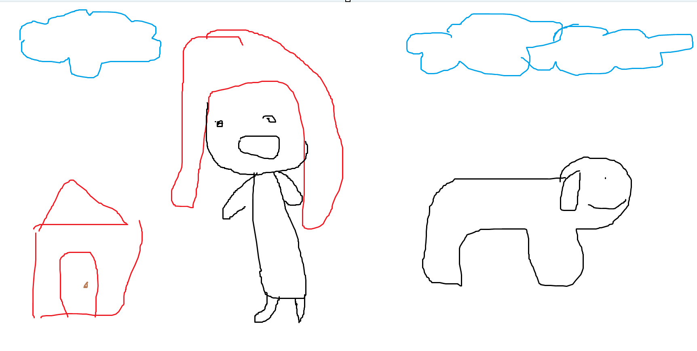
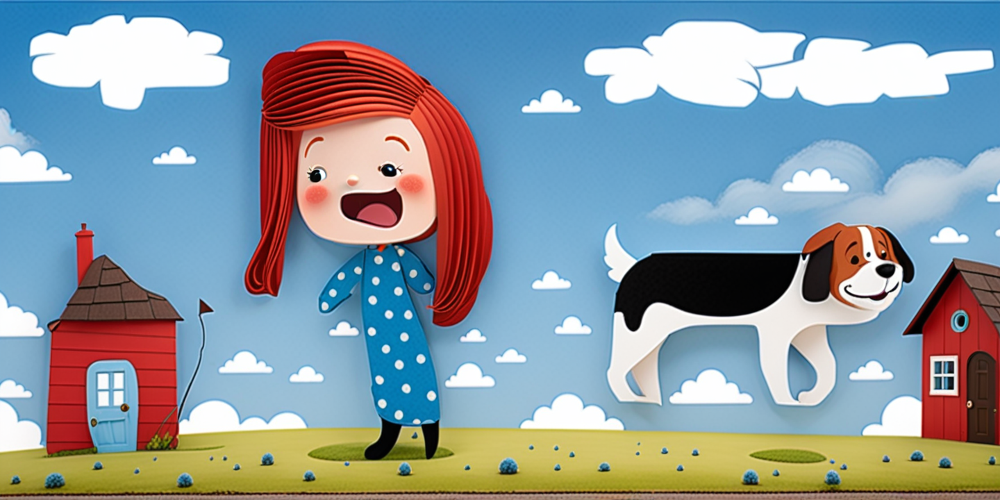

# 손그림에서 그림 생성하기
## Scribble Diffusion
- 손그림에서 그림을 생성하는 ai 모델을 찾다가 Scribble Diffusion 이라는 모델을 찾았다.
- https://s-eight.tistory.com/entry/Scribble-Diffusion-%EC%9D%B8%EA%B3%B5%EC%A7%80%EB%8A%A5%EC%9D%B4-%EB%82%99%EC%84%9C%EB%A5%BC-%EC%98%88%EC%88%A0%EB%A1%9C-%EB%A7%8C%EB%93%A4%EB%8B%A4
- 이후 Hugging Face에서 이 모델을 찾아볼 수 있었고 https://huggingface.co/xinsir/controlnet-scribble-sdxl-1.0 여기에 readme로 실행할 수 있는 예제 파이썬 스크립트가 있었다.
- 실행해보려고해도 공식 데모사이트에서 시연이 안됐기에, 로컬에서 구동해보고자 하였다.

### 가상환경
- `python -m venv .venv`명령어로 가상환경 생성후, 아래 패키지를 설치
```
accelerate==1.2.1
certifi==2024.12.14
charset-normalizer==3.4.1
colorama==0.4.6
diffusers==0.32.1
filelock==3.16.1
fsspec==2024.12.0
huggingface-hub==0.27.1
idna==3.10
importlib_metadata==8.5.0
Jinja2==3.1.5
MarkupSafe==3.0.2
mpmath==1.3.0
networkx==3.4.2
numpy==2.2.1
opencv-python==4.10.0.84
packaging==24.2
pillow==11.1.0
psutil==6.1.1
PyYAML==6.0.2
regex==2024.11.6
requests==2.32.3
safetensors==0.5.2
sympy==1.13.1
tokenizers==0.21.0
torch==2.5.1+cu118
torchaudio==2.5.1+cu118
torchvision==0.20.1+cu118
tqdm==4.67.1
transformers==4.48.0
typing_extensions==4.12.2
urllib3==2.3.0
zipp==3.21.0
```
- cuda와 torch의 버전을 맞춰주는것이 중요하다 -> https://pytorch.org/get-started/locally/ 여기서 버전에 맞는 torch를 찾을 수 있다.

## Scribble Diffusion 모델 실행
- readme의 파일은 실행이 안돼서 다른 프로젝트에 사용한 코드에서 로직부분만 추출하여 아래와 같은 코드를 새로 작성하였다.
```python
import os
import random
import torch
import numpy as np
from PIL import Image
import cv2
from diffusers import ControlNetModel, StableDiffusionXLControlNetPipeline, AutoencoderKL
from diffusers import EulerAncestralDiscreteScheduler


def apply_style(style_name: str, positive: str, negative: str = "") -> tuple[str, str]:
    styles = {
        "(No style)": ("{prompt}", "longbody, lowres, bad anatomy, bad hands, missing fingers, extra digit, fewer digits, cropped, worst quality, low quality"),
        "Cinematic": ("cinematic still {prompt} . emotional, harmonious, vignette, highly detailed, high budget, bokeh, cinemascope, moody, epic, gorgeous, film grain, grainy", "anime, cartoon, graphic, text, painting, crayon, graphite, abstract, glitch, deformed, mutated, ugly, disfigured"),
        # Add other styles here if needed
    }
    p, n = styles.get(style_name, styles["(No style)"])
    return p.replace("{prompt}", positive), n + negative


device = torch.device("cuda" if torch.cuda.is_available() else "cpu")

controlnet = ControlNetModel.from_pretrained(
    "xinsir/controlnet-scribble-sdxl-1.0",
    torch_dtype=torch.float16
)

vae = AutoencoderKL.from_pretrained(
    "madebyollin/sdxl-vae-fp16-fix", torch_dtype=torch.float16)

pipe = StableDiffusionXLControlNetPipeline.from_pretrained(
    "sd-community/sdxl-flash",
    controlnet=controlnet,
    vae=vae,
    torch_dtype=torch.float16,
)
pipe.scheduler = EulerAncestralDiscreteScheduler.from_config(
    pipe.scheduler.config)
pipe.to(device)

MAX_SEED = np.iinfo(np.int32).max


def generate_image(
    image: Image.Image,
    prompt: str,
    negative_prompt: str,
    style_name: str = "(No style)",
    num_steps: int = 25,
    guidance_scale: float = 5.0,
    controlnet_conditioning_scale: float = 1.0,
    seed: int = 0,
):
    width, height = image.size
    ratio = np.sqrt(1024.0 * 1024.0 / (width * height))
    new_width, new_height = int(width * ratio), int(height * ratio)
    image = image.resize((new_width, new_height))

    # Apply style
    prompt, negative_prompt = apply_style(style_name, prompt, negative_prompt)

    # Generate image
    generator = torch.Generator(device=device).manual_seed(seed)
    result = pipe(
        prompt=prompt,
        negative_prompt=negative_prompt,
        image=image,
        num_inference_steps=num_steps,
        generator=generator,
        controlnet_conditioning_scale=controlnet_conditioning_scale,
        guidance_scale=guidance_scale,
        width=new_width,
        height=new_height,
    ).images[0]

    return result


# Example usage
if __name__ == "__main__":
    input_image = Image.open("image.png")  # Replace with your image path
    output_image = generate_image(
        image=input_image,
        prompt="Generate a whimsical children's storybook illustration. The scene features a red-haired girl with a big smile standing next to a small red house with a triangular roof and a brown door. To her side is a cute, simple black-and-white dog with a rounded head and floppy ears. The background is filled with fluffy blue clouds in a bright sky.",
        negative_prompt="longbody, lowres, bad anatomy, bad hands, missing fingers, extra digit, fewer digits, cropped, worst quality, low quality",
        style_name="(No style)",
        num_steps=25,
        guidance_scale=7.5,
        controlnet_conditioning_scale=1.0,
        seed=random.randint(0, MAX_SEED),
    )
    output_image.save("output_image.png")
```
input


