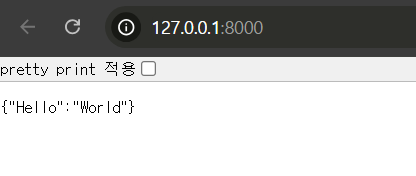
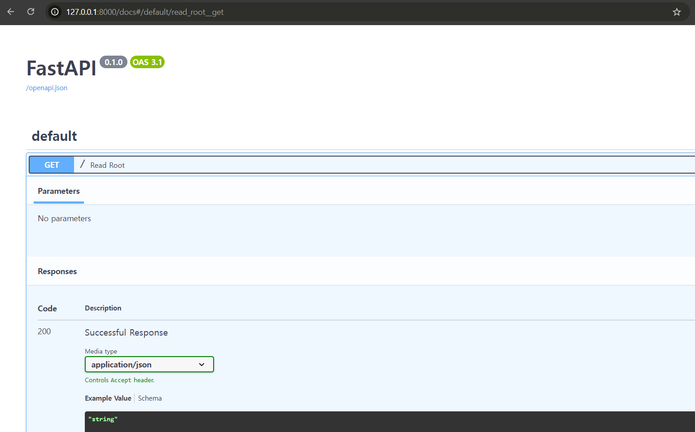

# Fast API
- FastAPI는 파이썬 백엔드 프레임워크이다.
- 특징으로는 빠르고, 쉬운 코드 작성과 직관적으로 작성할 수 있다는 것이다.

## requirements
```
annotated-types==0.7.0
anyio==4.8.0
certifi==2024.12.14
charset-normalizer==3.4.1
click==8.1.8
colorama==0.4.6
dataclass-wizard==0.34.0
distro==1.9.0
fastapi==0.115.6
h11==0.14.0
httpcore==1.0.7
httptools==0.6.4
httpx==0.28.1
idna==3.10
jiter==0.8.2
jsonpatch==1.33
jsonpointer==3.0.0
jupyter_client==8.6.3
jupyter_core==5.7.2
langchain-core==0.3.29
langchain-openai==0.3.0
langsmith==0.2.10
novita_client==0.7.1
openai==1.59.7
orjson==3.10.14
packaging==24.2
pillow==11.1.0
platformdirs==4.3.6
pydantic==2.10.5
pydantic_core==2.27.2
pydub==0.25.1
python-dateutil==2.9.0.post0
python-dotenv==1.0.1
pywin32==308
PyYAML==6.0.2
pyzmq==26.2.0
regex==2024.11.6
requests==2.32.3
requests-toolbelt==1.0.0
six==1.17.0
sniffio==1.3.1
starlette==0.41.3
tenacity==9.0.0
tiktoken==0.8.0
tornado==6.4.2
tqdm==4.67.1
traitlets==5.14.3
typing_extensions==4.12.2
urllib3==2.3.0
uvicorn==0.34.0
watchfiles==1.0.4
websockets==14.1
```
- jupyter, langchain, langsmith, novita_client, openai는 추가적으로 프로젝트에서 필요해서 설치한 것이고 FastAPI는 `uvicorn, fastapi`라이브러리만 pip로 설치하면 빠르게 시작할 수 있다.

## FastAPI Hello World!
```python
from fastapi import FastAPI
app = FastAPI()

@app.get("/")
def read_root():
    return {"Hello": "World"}
```
- 위와같이 코드를 작성하고, `uvicorn main:app --reload` 명령어로 실행하면

- get 형식으로 api를 사용할 수 있다.
- `localhost:8000/docs`에 들어가면 아래와같이 swagger docs도 자동 작성된다.


## Model
- Dto를 이용할땐 `pydantic`을 사용하면 된다.
```python
from fastapi import FastAPI
from pydantic import BaseModel, Field
app = FastAPI()


class RequestItem(BaseModel):
    id: int = Field(0, title="The ID of the item")
    name: str = Field(None, title="Name of the item", max_length=300)
    description: str = Field(
        None, title="Description of the item", max_length=300)


@app.get("/item", response_model=RequestItem)
async def get_item():
    return {"id": 1, "name": "Foo", "description": "There comes my hero"}
```